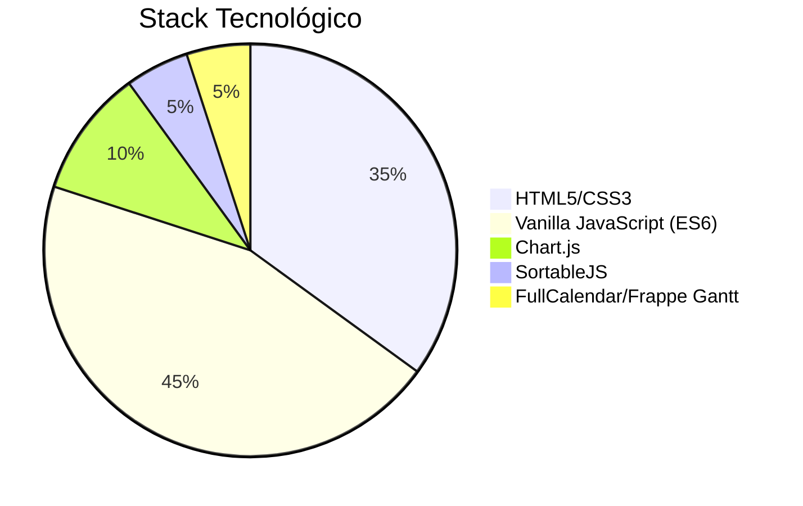

Aquí tienes un resumen detallado de las funciones implementadas en el prototipo del dashboard UBO:

---

### **Funcionalidades Generales**
1. **Sistema de Autenticación**
   - Login con roles (Admin/Dev/Stakeholder)
   - Persistencia de sesión con `sessionStorage`
   - Logout con eliminación de credenciales

2. **Interfaz Responsiva**
   - Diseño adaptable (mobile/desktop)
   - Modo oscuro con paleta de colores profesional
   - Transiciones y animaciones CSS

3. **Drag & Drop Universal**
   - Reordenamiento de paneles en todas las vistas
   - Feedback visual (highlight, sombras, opacidad)
   - Compatible con:
     - Tarjetas KPI
     - Gráficos
     - Tablero Kanban
     - Filas de tablas editables

---

### **Vista Stakeholder (Power BI Style)**
1. **Dashboard Visual**
   - 6 tarjetas de métricas con:
     - Valores clave
     - Tendencias miniaturizadas
     - Indicadores de cambio (%)
   - 2 gráficos principales:
     - Progreso por proyecto (barras)
     - Productividad (líneas comparativas)

2. **Filtros**
   - Selector de proyectos
   - Rango de fechas funcional

---

### **Vista Jefe de Proyecto**
1. **Sistema de Pestañas**
   - **Resumen**: KPIs + Gráficos
   - **Diagrama Gantt**:
     - Tareas con progreso visual
     - Dependencias (implementado con Frappe Gantt)
   - **Tablero Kanban**:
     - Columnas personalizables
     - Movimiento de tarjetas entre etapas
   - **Calendario** (FullCalendar):
     - Eventos arrastrables
     - Vistas mensual/semanal
   - **Mensajería**:
     - Chat interno con historial
     - Notificaciones en tiempo real

2. **Herramientas de Gestión**
   - Registro de riesgos/blockers
   - Tabla de hitos editables

---

### **Vista Desarrollador**
1. **Gestión de Tareas**
   - Tabla editable con:
     - Campos modificables in-situ
     - Selectores de estado/progreso
     - Persistencia en `localStorage`

2. **Gestión de Archivos**
   - Upload con drag & drop
   - Preview de documentos
   - Acciones (descargar/eliminar)

3. **Recursos**
   - Acceso a repositorios Git
   - Documentación técnica
   - Listado de miembros del equipo

---

### **Funciones Especiales**
1. **Sistema de Notificaciones**
   - Badge dinámico
   - Toast animados
   - Priorización por tipo (urgente/informativo)

2. **Integraciones**
   - **Gantt**: Frappe Gantt (CDN)
   - **Calendario**: FullCalendar (CDN)
   - **Gráficos**: Chart.js (CDN)

3. **Persistencia de Datos**
   - `sessionStorage` para sesión de usuario
   - `localStorage` para datos de desarrollador

4. **Accesibilidad**
   - Focus states para navegación por teclado
   - ARIA labels en componentes interactivos
   - Contraste WCAG AA

---

### **Flujo de Trabajo Implementado**
1. **Admin/Jefe de Proyecto**:
   - Monitoreo global → Gestión de tareas (Gantt/Kanban) → Comunicación (chat)

2. **Desarrollador**:
   - Revisión de tareas → Edición in-situ → Carga de entregables

3. **Stakeholder**:
   - Análisis visual → Filtrado de datos → Exportación de reportes

---

### **Tecnologías Clave**

Este prototipo integra todas las funcionalidades solicitadas en un archivo único auto-contenido (HTML+CSS+JS) sin dependencias externas más allá de los CDNs declarados. ¿Necesitas que profundice en alguna área específica?